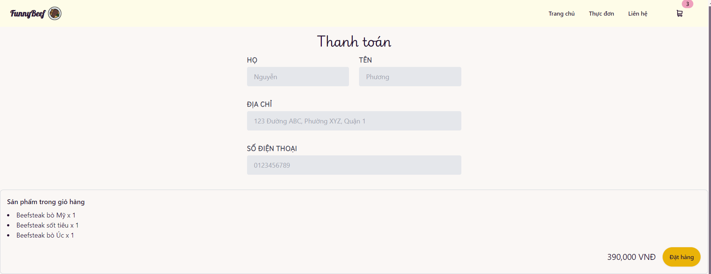

# FoodOrder
### [DEADLINE 11/11/2024]
### Yêu Cầu: không sử dụng web framework
Đề tài môn học: Xây dựng ứng dụng web đặt món ăn online

Tham khảo: https://www.beefsteakveggies.com/

##### Demo
<h3 align="center">Header</h3>

<h3 align="center">Menu</h3>

<h3 align="center">Empty cart</h3>

<h3 align="center">Cart</h3>

<h3 align="center">Checkout</h3>

<h3 align="center">Footer</h3>


###### TechStack
- HTML
- Tailwind CSS (plugin: [daisyUI](https://daisyui.com/))
- Vite
- Fuse.js (Chức năng tìm kiếm)
- Tailwind CSS Animation on Scroll [TAOS](https://versoly.com/taos)


###### Mô tả
Trang web đặt món ăn online, cho phép người dùng xem menu, thêm món ăn vào giỏ hàng và đặt hàng.

##### Theme
- Màu sắc: 
- Màu NavBar, Footer: #FEFCE8 (yellow-50)
- Màu phụ (nền): #FAF7F5 (gray-50), (#FFFFFF) (white)
- Màu chữ: #1F2937 (gray-900), #000000 (black)
- Fonts: Playwrite GB S, Lobster, Kavivanar, sans-serif

##### Chức năng
- Home page
    - [x] Navbar
    - [x] Header
    - [x] Menu
    - [x] Responsive

- Cart page
    - [x] Navbar
    - [x] Giỏ hàng
    - [x] Thêm, xóa món ăn
    - [x] Tính tổng tiền
    - [x] Responsive

- Checkout page
    - [x] Navbar
    - [x] Form đặt hàng
    - [x] Responsive

- Search
    - [x] Tìm kiếm món ăn fuzzy search  
    - [x] Responsive
    - [x] Hiển thị kết quả tìm kiếm
    - [x] Sử dụng Fuse.js
    
- Footer
    - [x] Responsive


Installation
To install the project, follow these steps:

1. Clone the repository
```
git clone https://5TKNgu/foododer
```

2. Install the dependencies
```
cd foododer
npm install
```

3. Start the project
```
npm run dev
```
